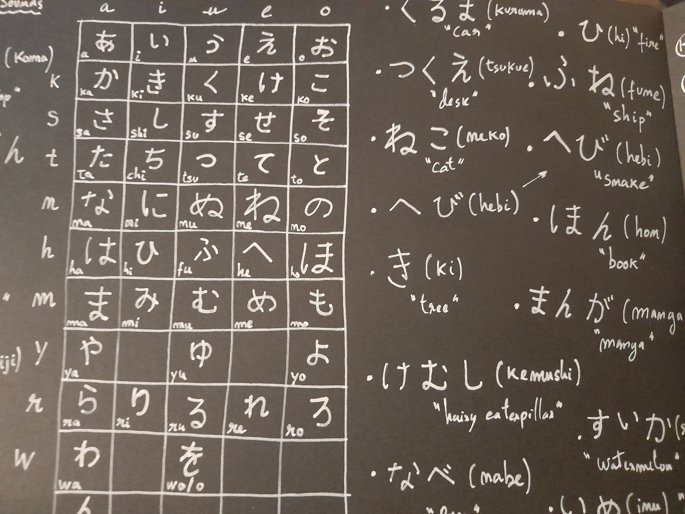

 

# Readme for Day 003

## Goals for Today
- Pick and choose what to include in the pyelftool  
- Consider and experiment with edge cases and final presentation  

## Progress Update
- Made list of useful items to present and the best way to do it  
- Tested different outputs  

### Japanese Tidbits

ゼロ- zero (katakana)  
零  - rei  (kanji)  
