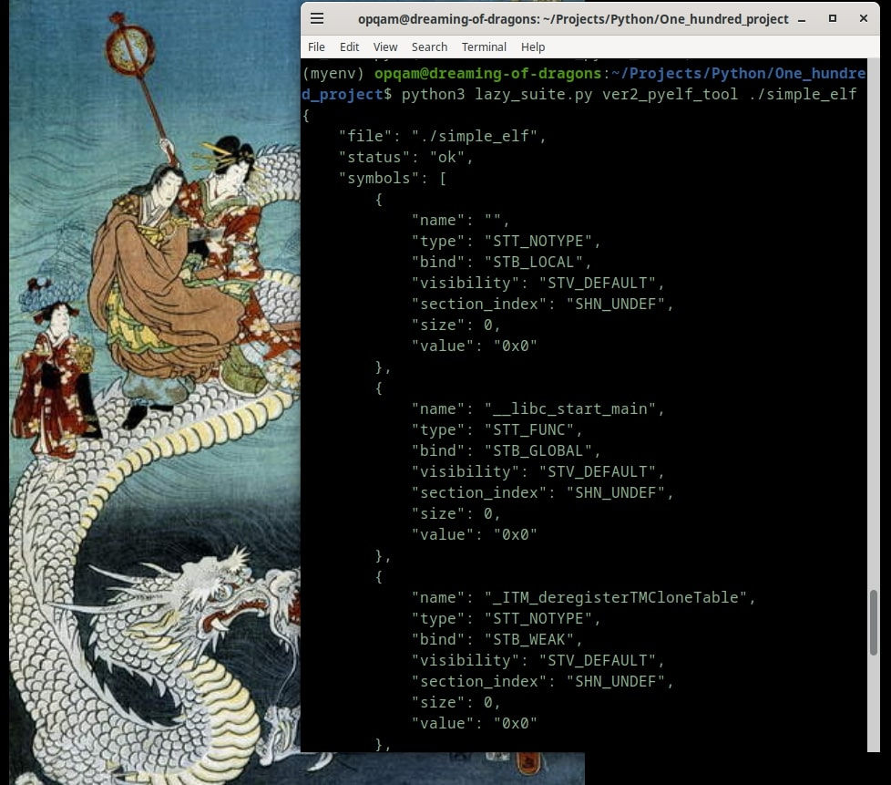

 

# Readme for Day 006

## Progress Update
- Make first mock-tool callable (by central hub)  
- Make mock-central hub (lazy_suite.py)  
- Test entry-point hub

### Japanese Tidbits
こんにちは、ドラゴンさん。(Konnichiwa, doragon-san.) - "Hello, Dragon."
